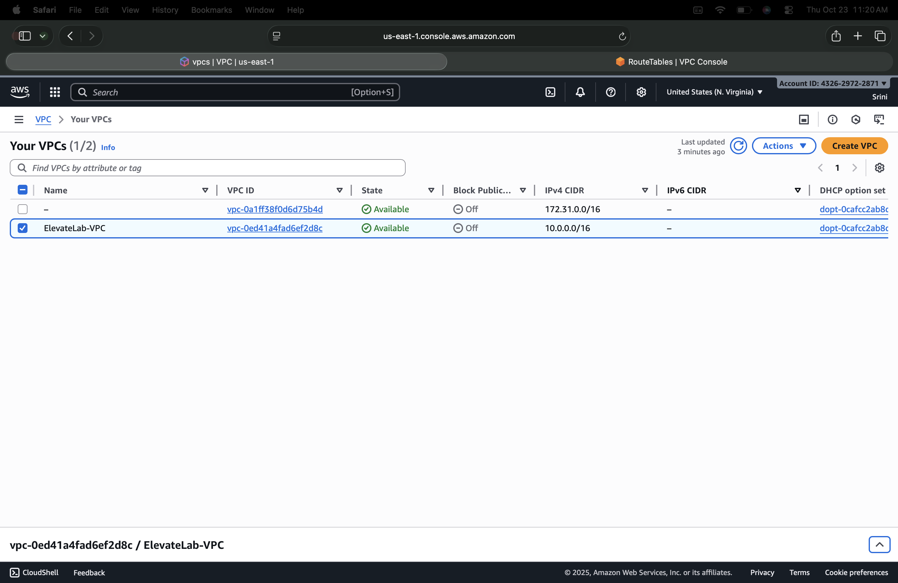
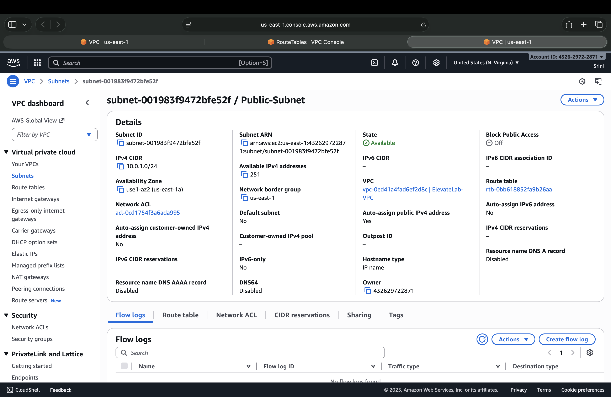
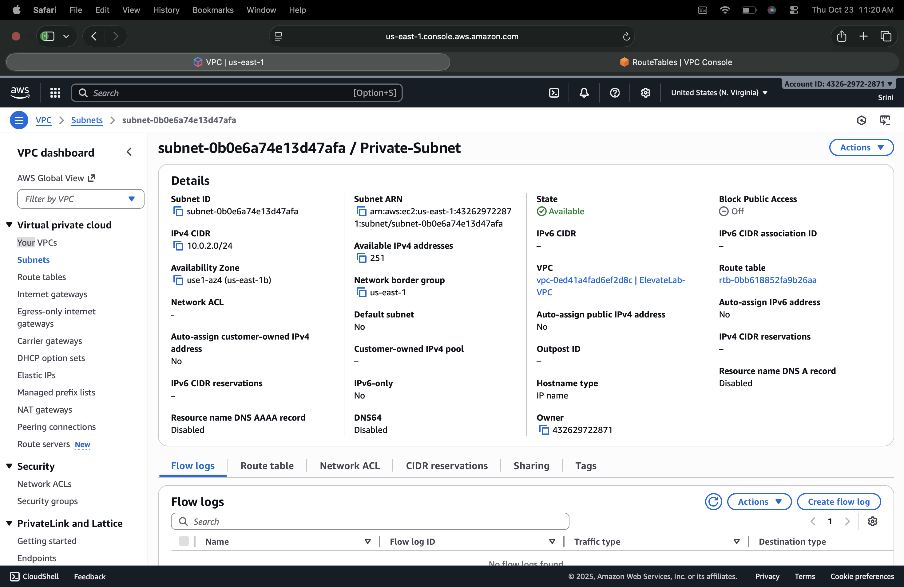
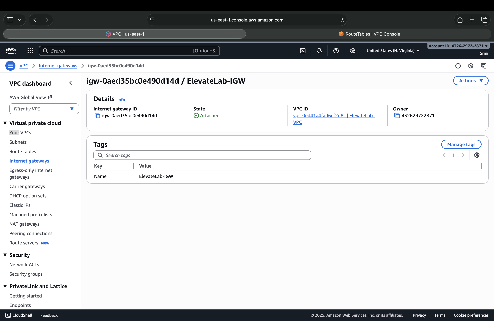
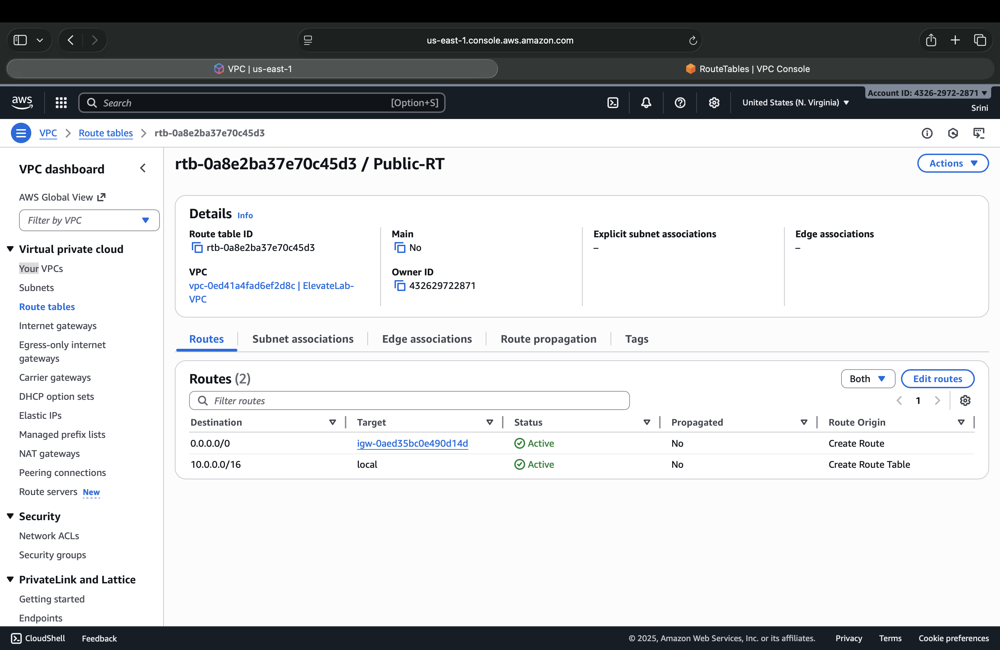
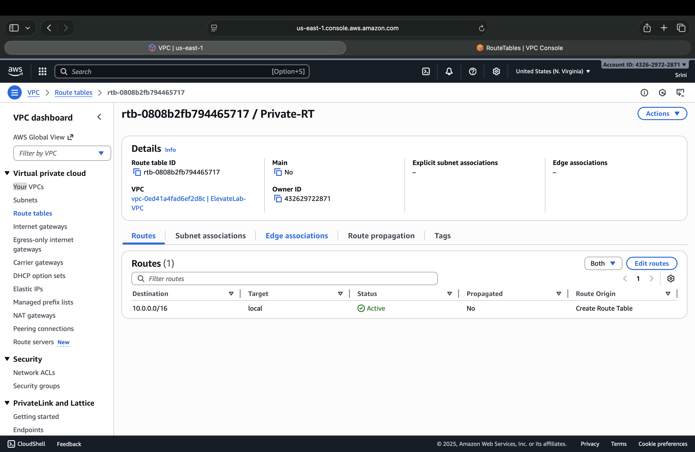
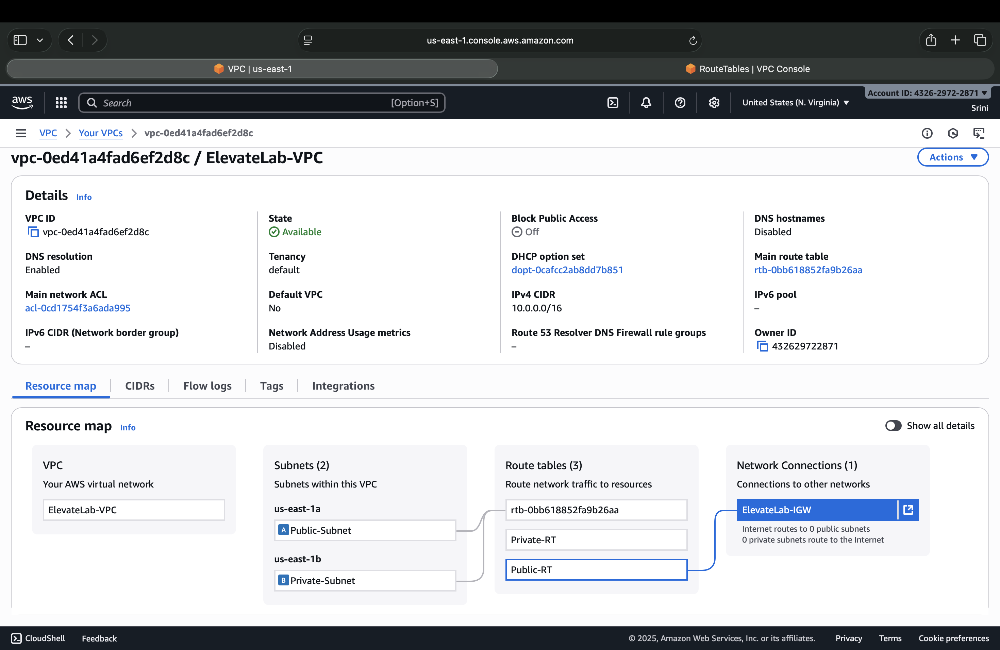

# ElevateLab AWS Task 3 — Create and Configure a Virtual Private Cloud (VPC)

## Objective
To understand **Virtual Private Cloud (VPC)** in AWS by creating and configuring a **custom network environment**, including **subnets**, **route tables**, and **internet connectivity**.  
This task helps beginners learn how to design and manage isolated network infrastructure in the cloud.

---

## Tools Used
- **AWS VPC**  
- **AWS Subnets, Route Tables, and Internet Gateway**  
- **AWS Management Console**  

---

## Deliverables
1. Screenshot of **VPC configuration**  
2. Screenshot of **subnets created**  
3. Screenshot of **route tables and associations**  
4. Screenshot of **internet gateway attached**  
5. Optional: **Diagram showing VPC architecture**

---

## Step-by-Step Guide

### Step 1: Create a New Virtual Private Cloud (VPC)
1. Click **Create VPC** → Choose **VPC only**.  
2. Set the following configuration:
   - **Name tag:** `ElevateLab-VPC`  
   - **IPv4 CIDR block:** `10.0.0.0/16`  
   - **Tenancy:** Default  
3. Click **Create VPC**.

**Screenshot:**

---

### Step 2: Create Subnets

1. Navigate to **Subnets → Create Subnet**  
2. Choose your VPC (`ElevateLab-VPC`)  

#### Public Subnet
* **Subnet name:** `Public-Subnet`  
* **Availability Zone:** ap-south-1a  
* **IPv4 CIDR block:** `10.0.1.0/24`  
* Enable **Auto-assign public IPv4 address**  

#### Private Subnet
* **Subnet name:** `Private-Subnet`  
* **Availability Zone:** ap-south-1b  
* **IPv4 CIDR block:** `10.0.2.0/24`  
* Disable **Auto-assign public IPv4 address**  

Click **Create Subnets**.

**Screenshot:** 

---

### Step 3: Create and Attach an Internet Gateway (IGW)
1. Go to **Internet Gateways → Create Internet Gateway**  
2. Name it: `ElevateLab-IGW`  
3. Click **Create Internet Gateway**  
4. Select it and choose **Actions → Attach to VPC**  
5. Attach it to your `ElevateLab-VPC`

**Screenshot:**  

---

### Step 4: Configure Route Tables

#### Public Route Table
1. Go to **Route Tables → Create Route Table**  
   - **Name:** `Public-RT`  
   - **VPC:** `ElevateLab-VPC`  
2. After creation, go to **Routes → Edit Routes → Add Route**  
   - Destination: `0.0.0.0/0`  
   - Target: **Internet Gateway (ElevateLab-IGW)**  
3. Save changes  
4. Under **Subnet Associations**, associate the **Public-Subnet**  

**Screenshot:**

#### Private Route Table
1. Create another Route Table:  
   - **Name:** `Private-RT`  
   - **VPC:** `ElevateLab-VPC`  
2. No route to the Internet Gateway (keeps it isolated)  
3. Associate this table with the **Private-Subnet**  

**Screenshot:**  

---

### Step 5: Verification
1. Go to **VPC → Subnets**  
2. Verify configuration:  
   * **Public Subnet:** Connected to Internet Gateway  
   * **Private Subnet:** No external connectivity  

**Screenshot:**  

---

## Configuration Summary

| Component     | Name           | CIDR Block  | Internet Access | Notes                    |
| ------------- | -------------- | ----------- | --------------- | ------------------------ |
| VPC           | ElevateLab-VPC | 10.0.0.0/16 | —               | Main network             |
| Subnet 1      | Public-Subnet  | 10.0.1.0/24 | ✅ Yes           | Associated with IGW      |
| Subnet 2      | Private-Subnet | 10.0.2.0/24 | ❌ No            | Isolated                 |
| IGW           | ElevateLab-IGW | —           | —               | Enables internet access  |
| Route Table 1 | Public-RT      | —           | ✅               | Linked to Public Subnet  |
| Route Table 2 | Private-RT     | —           | ❌               | Linked to Private Subnet |

---
